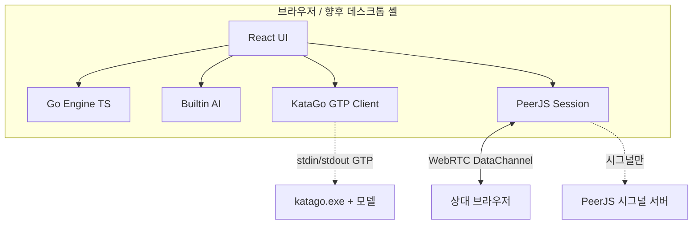

# SVIL Baduk 시스템 아키텍처

**버전:** 0.1.0  
**작성일:** 2026-07-23

---

## 1. 한눈에



**원칙:** 대국 상태는 클라이언트(및 P2P 피어)에만 둔다. 앱 전용 게임 서버는 없다.

## 2. 레이어

| 레이어 | 책임 | 경로 |
|--------|------|------|
| Presentation | 화면·보드·설정·i18n | `src/screens/`, `src/components/` |
| Domain | 규칙·수·합법성 | `src/engine/` |
| AI | 급단·내장수·GTP | `src/ai/` |
| Network | P2P 메시지 | `src/p2p/` |
| Persistence | 설정 localStorage | `src/settings/` |
| Content | 레슨·히스토리 | `src/learn/`, `src/history/` |

## 3. 도메인 모델

```
GameState
  size, board[], toPlay, captures, history[], koPoint, consecutivePasses, ended
Move
  player, x, y, pass?, captured[]
```

상태 갱신은 불변 복사(`cloneState`) 후 새 객체로 교체. UI는 `useState`로 보유.

## 4. AI 아키텍처

```
급단 선택 → visits / randomness
         ├─ KataGo available? → genmove
         └─ else → builtin score+random
```

- **Builtin:** 합법수 중 따냄·중앙 선호 + randomness
- **KataGo:** Transport 인터페이스만 브라우저에 두고, 실제 프로세스는 데스크톱 사이드카(예정)

```ts
type KataGoTransport = {
  send: (line: string) => Promise<string>
  isConnected: () => boolean
}
```

## 5. P2P 아키텍처

1. 양측 Peer 인스턴스 생성 → 방 ID
2. 게스트가 호스트 ID로 `connect`
3. `sync-request` → 호스트 `hello`(size, hostColor)
4. 이후 `move` / `resign` 동기화

신뢰: DataChannel `reliable: true`.  
권위: v0.1은 각자 `tryPlay`로 검증(충돌 시 거부). 이후 호스트 authoritative 검토.

## 6. UI · 접근성 구조

- CSS 변수 토큰 (`src/index.css`)
- 보드 시각: 선·돌·합법점·포커스·직전수 계층
- `prefers-reduced-motion` + 설정 `reduceMotion`

## 7. 빌드 · 배포

| 항목 | 현재 | 예정 |
|------|------|------|
| 번들 | Vite SPA | 동일 |
| 호스팅 | 로컬/`gh-pages` 후보 | 랜딩+앱 |
| 데스크톱 | — | Tauri로 KataGo spawn |
| CI | — | test+build |

## 8. 보안 · 프라이버시

- 계정/개인정보 수집 없음
- P2P 수 데이터는 피어 간 직통
- PeerJS 시그널에 방 ID만 노출
- KataGo 모델/바이너리는 로컬, git에 올리지 않음

## 9. 확장 포인트

1. `KataGoTransport` Tauri command 구현
2. 계가 모듈을 engine 옆 `scoring.ts`로 분리
3. SGF import/export
4. TURN 서버 옵션(설정)
