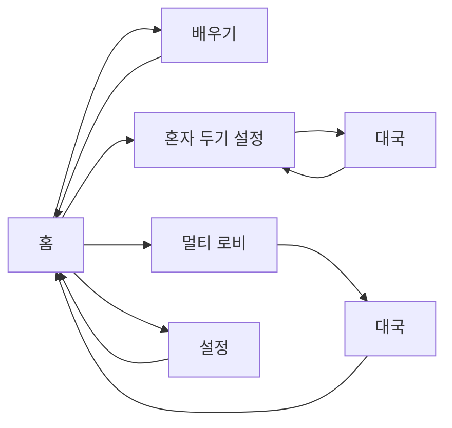

# SVIL Baduk 화면 스토리보드

**버전:** 0.1.0  
**작성일:** 2026-07-23

---

## 0. 전체 흐름



톤: 다크 배경 + 큰 버튼 + 브랜드명 **SVIL Baduk**이 홈 히어로.

---

## 1. 홈

**목적:** 모드 선택 한 가지.

| 영역 | 내용 |
|------|------|
| 히어로 | `SVIL Baduk` + 한 줄 태그라인 |
| CTA | 단계별 배우기 / 혼자서 두기 / 상대랑 두기 / 설정 |

**저시력 포인트:** 세로 스택, 버튼 높이 ≥50px, 고대비 primary.

---

## 2. 단계별 배우기

```
[뒤로]  단계별 배우기
진행  1/4 · 2/3
레슨 제목
┌ 카드 ─────────────┐
│ 스텝 제목          │
│ 본문               │
│ 힌트 뱃지          │
└──────────────────┘
[이전] [다음]
목차 리스트 (활성 언더라인)
```

**완료 시:** “혼자서 두기로 연습” 메시지.

---

## 3. 혼자 두기 — 설정

```
판 크기     [9 / 13 / 19]
상대 급단   [30급 … 5단]
내 색깔     (○ 흑  ○ 백)
AI 상태     내장 AI / KataGo ON
[대국 시작]
```

---

## 4. 혼자 두기 — 대국

```
도움말: 깜빡임 · Tab · Enter
┌ 보드 SVG ────────┐  ┌ 패널 ────────┐
│ 선·돌·깜빡 점     │  │ 상태 문구     │
│ 직전 수 마커      │  │ 흑/백 딴 돌   │
│                   │  │ 직전 수       │
└──────────────────┘  │ [패스][기권][뒤로] │
                       └──────────────┘
```

**상태 문구 예:** `당신 차례` / `AI 생각 중…` / `대국 종료`  
**오류:** `둘 수 없는 자리입니다` (색+텍스트).

---

## 5. 멀티 — 로비

```
내 방 ID   [xxxxxxxx] [ID 복사]
판 크기 / 호스트 색깔
[방 만들기]
상대 방 ID [________]
[방 참가]
상태: 대기 중… / 연결됨
```

**시나리오 A (호스트):** 방 만들기 → ID 공유 → 게스트 접속 → 자동 대국  
**시나리오 B (게스트):** ID 입력 → 참가 → hello 수신 → 대국

---

## 6. 멀티 — 대국

혼자 두기와 동일 보드·패널.  
내 차례만 입력. 상대 차례는 `상대 연결 대기`류 문구.

---

## 7. 설정

```
언어 / 글꼴 / 글자 크기
☑ 착수점 깜빡임
☑ 최대 대비 보드
☑ 움직임 줄이기
▸ KataGo 안내
▸ 히스토리 (버전별 2~4줄)
```

---

## 8. 모션

| 모션 | 용도 |
|------|------|
| 착수점 깜빡임 | 합법수 위치 강조 |
| 포커스 링 | 키보드 위치 |
| (예정) 돌 착수 페이드 | 존재감, reduce-motion 시 생략 |

---

## 9. 카피 톤

- 짧고 직접적, 전문 바둑 용어는 레슨에서 바로 설명
- 상태·오류는 라벨 필수 (“불법수”만이 아니라 문장)
