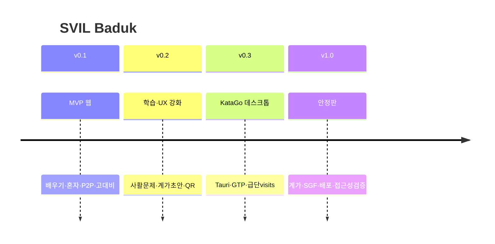

# SVIL Baduk 로드맵

**작성일:** 2026-07-23  
**현재 버전:** 0.1.0

---

## 버전 규칙 요약

| 단계 | 예 | 의미 |
|------|-----|------|
| 패치 | 0.1.x | 버그·소기능 |
| 마이너 | 0.2.0 | 기능/UI 마일스톤 |
| 안정 | 1.0.0 | RC 완료 |

상세: 루트 `VERSIONING.md`

---

## 타임라인 (목표)

---

## v0.1.0 — MVP (완료)

- [x] 규칙 엔진 (착수/따냄/패/패스)
- [x] 고대비 보드·깜빡임·키보드
- [x] 단계별 배우기 4레슨
- [x] 혼자 두기 급단 + 내장 AI
- [x] P2P 멀티 (PeerJS)
- [x] 설정·i18n·히스토리
- [x] GitHub public + docs 골격

---

## v0.1.x — 안정화

- [ ] P2P 연결 실패/재연결 UX
- [ ] 엔진: 단순 패 외 슈퍼코 검토
- [x] 레슨 본문 영어 (기타 언어 확장 여지)
- [x] 레슨 본문 ja/zh/vi
- [ ] 단위 테스트 확대 (패 상황)
- [x] `gh-pages` 배포 스크립트·CI (실제 배포는 `npm run deploy`)

---

## v0.2.0 — 학습 · UX

- [x] 사활·따냄 연습 문제 (보드 연동)
- [x] 초보 계가(영역+사석 대략)
- [x] 멀티 방 ID QR 공유
- [x] 착수 소리 on/off (저시력 보조, 선택)
- [x] 돌 크기/선 굵기 설정 단계

---

## v0.3.0 — KataGo 실연동

- [ ] Tauri(또는 Electron) 셸
- [x] `katago.exe gtp` spawn + transport (로컬 HTTP 브리지)
- [x] 급단 → maxVisits 힌트 (실측 튜닝 잔여)
- [x] 모델 경로 설정 UI·README
- [ ] GPU/CPU 자동 감지 문구

---

## v0.4.0 — 기보 · 복기

- [x] SGF 저장/불러오기
- [x] 수순 되감기·앞으로
- [x] (선택) AI 힌트 마커 (분석 색칠은 이후)
- [ ] (선택) KataGo 분석 색칠(숫자+라벨)

---

## v1.0.0 — 안정판

- [ ] 룰 선택(일본/중국) + 덤
- [ ] 접근성 점검 체크리스트 통과 (저시력 사용자 피드백)
- [ ] 배포 파이프라인 + 서명된 데스크톱 빌드
- [ ] Outline 위키·랜딩 페이지 정합

---

## 의도적으로 미룸

| 항목 | 이유 |
|------|------|
| 계정·레이팅 서버 | 서버리스 원칙 |
| 모바일 스토어 | 데스크톱·웹 우선 |
| 온라인 기보 클라우드 | 로컬/P2P 우선 |

---

## 의존성

- PeerJS 공개 시그널 가용성 → 실패 시 자체 시그널/TURN 검토
- KataGo 라이선스·모델 재배포 정책 준수
- SVIL 디자인 토큰 변경 시 CSS 변수만 갱신
